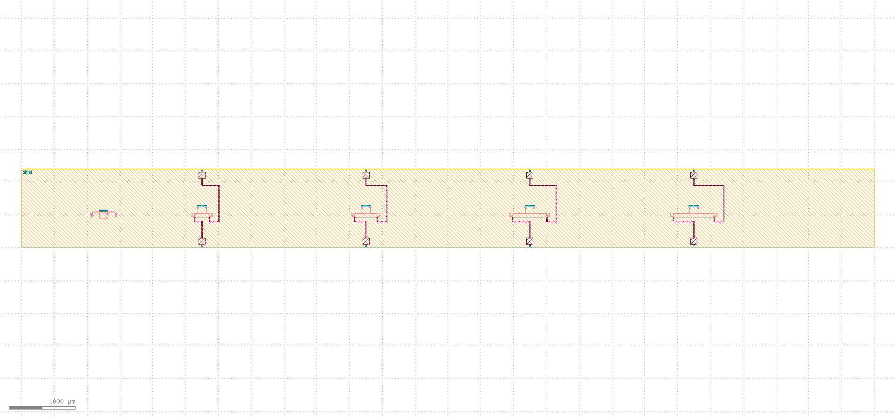
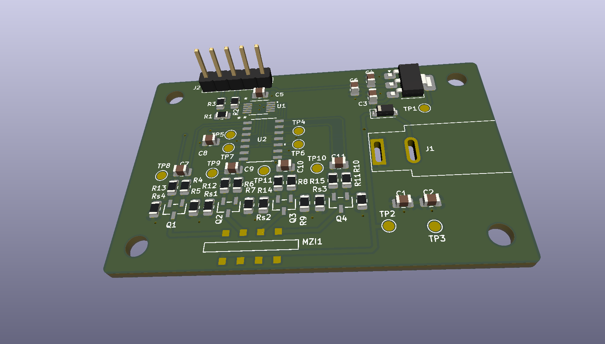
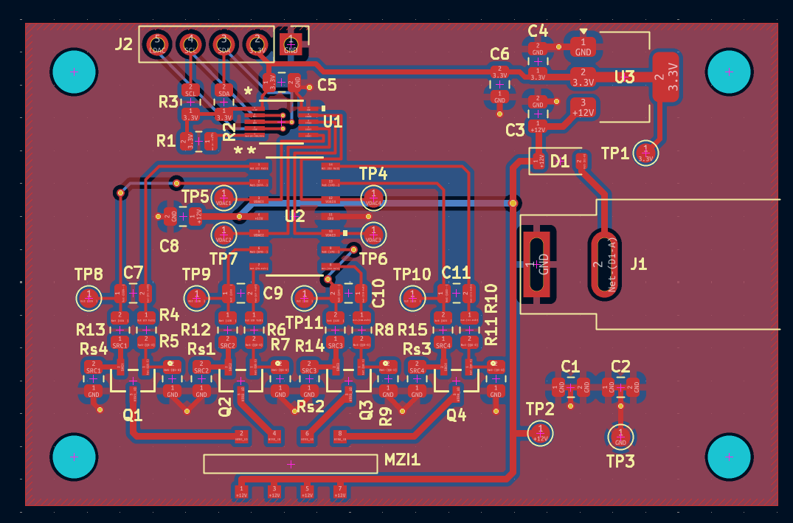
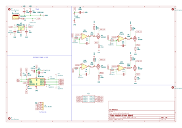

# Mach-Zender Interferometer Photonic Integrated Circuit

A photonic integrated circuit designed in Python with [gdsfactory](https://github.com/gdsfactory/gdsfactory), laid out in [KLayout](https://www.klayout.de/), with a companion PCB designed in [KiCad](https://www.kicad.org/).

Chip implements four Mach-Zender-Interferometers of varying lengths, with accompanying chip providing all required electrical usage and testing hardware.

## Gallery

| Die Layout | PCB 3D View |
|:---:|:---:|
|  |  |
| **PCB 2D View** | **Circuit Schematic** |
|  |  |

## Features

- Four MZIs with thermal phase shifters
- 12V barrel jack connector for power
- Glue-in spot on PCB for inserting MZI chip

## PDK

This design uses gdsfactory's open-source generic PDK, so the whole layout can be regenerated and freely shared. Layer numbers and components are generic and not tied to any commercial foundry process.

## Tools
- **gdsfactory**: parametric layout in Python
- **KLayout**: layout viewing and rendering
- **KiCad**: schematic and PCB design
